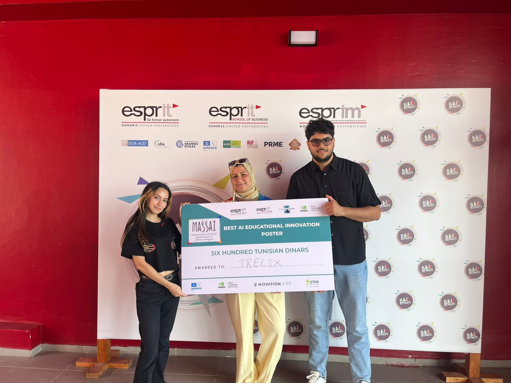

<h1 align="center">Hi there 👋, I'm Jihed Horchani</h1>

  🎓 Software Engineering Student | 💻 Full-Stack Developer | 🚀 DevOps Enthusiast  

  
  
  

---

## 👨‍💻 About Me

I'm a passionate software engineering student at **ESPRIT**, Tunis.  
I love building full-stack applications, designing scalable microservices, and automating deployments using DevOps practices.

---
## 🏆 Awards

  
   Massai 2025 – Best Poster Award in the Education Field

## 💼 Experience

### 🔧 DevOps Intern – Abshore (Jul 2024 – Aug 2024)
- CI/CD pipeline automation with **Docker, Jenkins, Selenium**
- Symfony deployments with **GitHub Webhooks**

### 🖥️ IT Staff – Tunisie Telecom (Aug 2022 – Sep 2022)
- Supported IT operations and ensured performance reliability

---

## 🚀 Projects

### 📚 E-Learning Platform (MERN Stack)
> MongoDB | Express.js | React.js | Node.js | Docker | Jenkins  
- Full-stack development with authentication and file management  
- CI/CD + SonarQube + GitHub Integration

### ⛷️ Skier Management System (Microservices)
> Spring Boot | Angular | React | Keycloak | Docker Compose  
- Microservices + API Gateway + Eureka  
- Independent services with modular databases

### 🔁 DevOps CI/CD Pipeline
> Jenkins | SonarQube | Nexus | GitHub | JUnit  
- Quality gates, webhook triggers, and artifact management

### 🍽️ Food Management App
> JavaFX | Symfony | MySQL  
- Desktop & Web cross-platform data synchronization

### 📱 Food Mobile App
> FlutterFlow | Firebase  
- Real-time sync, user management, intuitive UI

### 🎮 Mini Tunisian Game
> SDL | C++ | Linux  
- 2D game inspired by Tunisian culture

---

## 🧠 Skills

| 💻 Languages        | 🛠️ Tools & Frameworks         | 🧪 DevOps & Testing     |
|--------------------|-------------------------------|--------------------------|
| Java, JS, C++, C#   | Node.js, React, Symfony, Spring Boot | Docker, Jenkins, Selenium |
| SQL, MongoDB, H2    | Angular, Express, JavaFX      | SonarQube, Nexus, GitHub |
| GraphQL             | Qt, Arduino                   | JUnit, Mockito           |

---

## 📜 Certifications

- **Apollo GraphQL** – Apr 2025  
- **IEEE Cyber Security Challenge** – Dec 2024  
- **IEEE DeepFake Forensics Challenge** – Dec 2023  

---

## 🌍 Languages

- 🇹🇳 Arabic – Native  
- 🇫🇷 French – Fluent  
- 🇺🇸 English – Professional  

---

## 🤝 Let's Connect

I'm always open to new ideas, projects, or opportunities!  
Feel free to reach out via [email](mailto:Jihed.Horchani@esprit.tn) or [LinkedIn](https://www.linkedin.com/in/jihed-horchani/).

---

  <em>“Code is like humor. When you have to explain it, it’s bad.” – Cory House</em>

